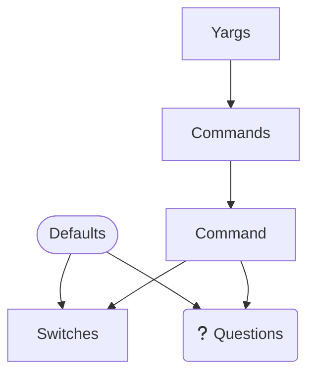

# Arguments

## Usage

Major files:
- `routes.ts` - declaration of all known command line flags, commands. Only Names as enums.
- `context.ts` - typed version of the Arguments that we design to use after parsing
- `params.ts` - Expanded declaration of the arguments, with data types, default values, prompts/questions;

## How the arguments are parsed and processed

Everything done by steps:
1. Compose map of abstractions that will be recognized well by `prompts` and `yargs` libraries
2. Parse command line arguments by `yargs` library
3. Ask questions/confirmations by `prompts` library
4. Produce `context` object that is typed and ready to use

## Abstractions

### Yargs - `params.ts`

Declaration of high-level commands that recognized well by yargs and allows to create different routes of CLI execution.

Common declaration of command includes:
- aliases, shorter/longer names of the command. `$0` used for declaring a default command that will be selected by YARGS if user does not provide any command by arguments.
- description - user-friendly description of the command. Used for HELP messages;
- options - array of options/switches/flags names that command recognize; (only names, the best is to use enums from `routes.ts`)
- questions - array of confirmation questions that command may ask during parsing (only names, the best is to use enums from `routes.ts`). Questions are asked by `prompts` library. `Prompts` structure used for declaring the prompts/questions.

Keywords: `yargs`, `commands`, `command`, `options`, `questions`, `prompts`

Refs:
- http://yargs.js.org/docs/#api-reference-commandcmd-desc-builder-handler

> Note: all commands should have unique name

#### Commands, Command - `types.ts`

* `Commands` - Declaration of the data type that used for describing set of commands.
* `Command` - Declaration of the data type that used for describing single command.

### Options - `params.ts`

Declaration of all known options/switches/flags that command
line tool recognize. Options are declared as object with unique properties.

Common declaration of option includes:
- alias - shorter/longer name of the option.
- describe - user-friendly description of the option. Used for HELP messages;
- type - data type of the option. Used for parsing and validation.
- defaultDescription - user-friendly description of the default value. Used for HELP messages; Should be used for secured options.

Keywords: `options`, `switches`, `flags`, `masked`, `secured`, `hidden`, `switch`, `option`

> Note: all options should have unique name

#### Switches, Switch - `types.ts`

### Prompts - `params.ts`

User-friendly prompts/question that CLI may ask during parsing.
Also in question should be provided hint which value is actually expected/recognized (examples: yes/no, globs: `**/*.md`).
Also can be defined more precise data types for the answers (examples: 'confirm' - yes/no, )

Refs:
- https://github.com/terkelg/prompts
- https://github.com/terkelg/prompts#confirmmessage-initial

#### Questions - `types.ts`

### Defaults - `params.ts`

Declaration of defaults for options. Should be used for declaring default values, fallbacks, overrides by OS environment variables.

Major rule: from array of defaults selected first truly defined value.

#### Predefined - `types.ts`

